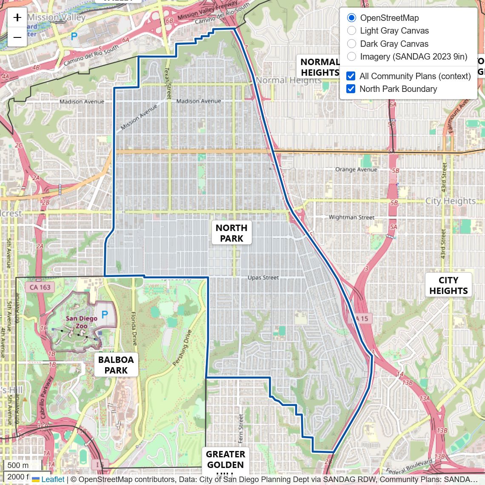

# North Park Leaflet Map

Embeddable web map of San Diego Community Plan Areas with emphasis on **North Park**.
Built with Leaflet + Esri Leaflet using public SANDAG services.

[](https://joshalogs.github.io/north-park-leaflet-map/)

---

## Embed this map in your site

**Square (1:1) — modern CSS (preferred):**

```html
<div style="max-width:600px; margin:0 auto; aspect-ratio:1/1;">
  <iframe
    src="https://joshalogs.github.io/north-park-leaflet-map/"
    title="North Park Planning Map"
    style="width:100%; height:100%; border:0"
    loading="lazy"
    referrerpolicy="no-referrer"
  >
  </iframe>
</div>
```

**Square (1:1) — legacy fallback (padding hack, for older browsers/CMS):**

```html
<div style="max-width:600px; margin:0 auto; position:relative; width:100%; padding-bottom:100%;">
  <iframe
    src="https://joshalogs.github.io/north-park-leaflet-map/"
    title="North Park Planning Map"
    style="position:absolute; inset:0; width:100%; height:100%; border:0"
    loading="lazy"
    referrerpolicy="no-referrer"
  >
  </iframe>
</div>
```

**Fixed size (simple):**

```html
<iframe
  src="https://joshalogs.github.io/north-park-leaflet-map/"
  title="North Park Planning Map"
  width="600"
  height="600"
  style="border:0"
  loading="lazy"
  referrerpolicy="no-referrer"
>
</iframe>
```

**Notes**

- Adjust size or `max-width` as needed; the map is responsive inside the iframe.
- Use HTTPS on your site; most CMSes allow iframes from GitHub Pages.
- If iframes are blocked, link to the live map instead.

---

## Where to change things

- **Layer/data config:** `config.js` (overlays, styling, labels on/off, fit-to-bounds).
- **Label names:** `data/cpa-labels.csv` (`CPNAME,Label`; use `|` for line breaks).
- **Styles:** `styles.css` (label pill, focus ring, layout).
- **Map logic:** `main.js` (basemaps, imagery reference, contrast profiles).

---

## Data & attribution

- Community Plan Areas: [SANDAG RDW – Community_Plan_SD (FeatureServer)](https://geo.sandag.org/server/rest/services/Hosted/Community_Plan_SD/FeatureServer/0)
- Imagery: [SANDAG 2023 Nearmap 9″ (ImageServer)](https://gis.sandag.org/sdgis/rest/services/Imagery/SD2023_9inch/ImageServer)
- Reference: [Esri “Hybrid Reference Layer (US Edition)” – Vector Tile Layer](https://www.arcgis.com/home/item.html?id=5447e9aef0684ec391ae9381725f7370)
- Basemaps: [OpenStreetMap](https://www.openstreetmap.org/copyright); Esri Canvas Light Gray ([Base](https://services.arcgisonline.com/arcgis/rest/services/Canvas/World_Light_Gray_Base/MapServer), [Reference](https://services.arcgisonline.com/arcgis/rest/services/Canvas/World_Light_Gray_Reference/MapServer)); Esri Canvas Dark Gray ([Base](https://services.arcgisonline.com/arcgis/rest/services/Canvas/World_Dark_Gray_Base/MapServer), [Reference](https://services.arcgisonline.com/arcgis/rest/services/Canvas/World_Dark_Gray_Reference/MapServer))

Attributions appear in the map control.

---

## Notes

- Portions of this project were assisted by generative AI. All code and content were reviewed and edited by the maintainers.

---

## License

MIT — see `LICENSE`.
